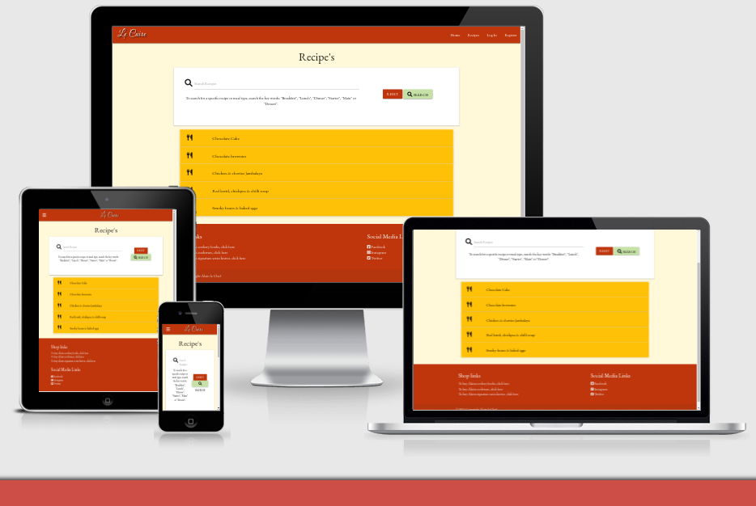
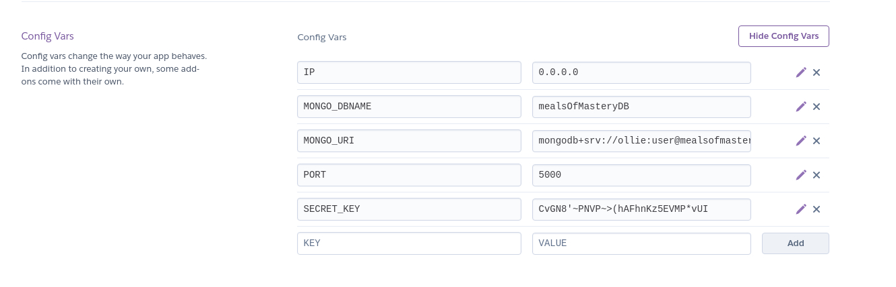

# Le Cuire
------
## About Le Cuire

Le Cuire is the latest and greatest website index for cooking recipes, initially the dream child of 6 time michellin star chef Alain le chef in 2015. In late 2016 Alain le chef sought out the most competent of designers to create a chic and stylish website that can compete with the best of the best in the cooking recipe industry. Alain's vision was for all chefs from around the world to be able to collaborate on an online cookbook that is acessible to everybody, containing the tastiest dishes from around the globe, acessible from right within your own home.

------
## User Requirements

### First time user
* Find Recipes
* Easily find their social media links
* I want to be able to easily navigate throughout the site to find content
* I want to see what others are saying about the website

### Returning User
* I want the webstie to be Enjoyable to come back and use again
* I want to be albe ot maintain contact with the owner, for example via a newsletter
-------
## Owner Goals
* To Promote Alain le Chef's new line of cooking utensils
* To keep a loyal base of recipe adders and creators
* 
-------
## Wire Frames
Here is the basic outline for the project

-------
## Features
* The website will allow the user to store and easily access cooking recipes (including fields like: ingredients, preperation steps, required tools and cuisine).
* Backend and front end functionality for users to locate recipes based on the recipe's fields.
* Results will be visually appealing to the user.
* Responsive on all pages and formats
* interactive elements

### Home Page
This is where all the information that a customer new or old that they might want to know will be. it is the first page they see, so it must be useful.

* The website will have 4 information tiles: seasonal recipes, news, reviews and events

### Login Page
Login page should be simple and easy to follow, it is a page used for loggin in, it must be in the same style as the other pages for uniformity, it should work well and feel effortless to use.

* This page will just have login functionality, no extras as they arent needed 

### Recipe Index Page
This is the page that everybody has come for, so it must be easy to use and useful for people looking for recipes, the recipes should be easy to find and it should be an enjoyable experience

This page will have:

* Drop down sections for each recipe, the recipes will be listed in rows with clickable sections to open up to the ingredients and instructions making it interactive and to improve the users experience
* Search functionality to cut the users searching time down and to make it easier for the user to find what theyre looking for 

### Register Page
Similar to the login page, only thing needed is register functionality, enter your details and start using the website to its full potential

This page will have:

* Form to enter your details and store those details in a database which then allows you to publish recipes using your login credentials 

### Add Recipe Page
Another key page in the website, this page will have a form with all the sections you need to have to know how to cook a meal, for example: ingredients, instructions, cooking time, what the course and meal type it is etc..

This page will have:

* Form containing a drop down selector for meal type (breakfast lunch dinner) and course types
* Form containing recipe name
* Form containing cooking instructions
* Form containing cooking time
* Form containing cleaning time
* Form containing preperation  time
* Form containing total cooking time
* Submit button

### Edit Recipes Page
Very similar to the add recipe page, except when you go to edit a recipe, the form should already be filled by the recipe youve decided to edit

This page will have:

* Form containing a drop down selector for meal type (breakfast lunch dinner) and course types
* Form containing recipe name
* Form containing cooking instructions
* Form containing cooking time
* Form containing cleaning time
* Form containing preperation  time
* Form containing total cooking time
* Submit button

All of these should be filled with data from the recipe you have decided to edit

### Profile Page
The profile page should display your information, for example your name

page contains:
* Login credentials ie: Name

-------
## Technologies Used
* HTML
    * HTML is used on every page to create the skeleton of the website and to lay down the fundementals that build the website.
* CSS
    * CSS is used on every single page to style the website and to provide individual style to specific elements.
* Python
    * Python is used t oconnect the website to the database and to connect the pages of the website together, for example, the base html page being the basis for each page being linked via python to each page the user see as the base.hmtl page isnt a page that the user actually sees.
* JavaScript
    * JavaScript is used to bring interactive functionality into the page, it is used on most pages for informing hte user that the information they have put doesnt fit the requirements in the add recipes page for example adding a green or red line below the parameters.
* JQuery
    * Jquery is a simpler version of JavaScript which for this project is used for more elements than javascript, JQuery was used to bring user interactivity to dropdown elements such as the meal type or the recipes dropdown.
* Flask
    * 
* Heroku
    * Heroku is the deployment service i used to deploy the website.
* MongoDB
    * MongoDb is the database i used to hold the user, recipes and the meal type data 
* Git
    * Git was used for version control by utilizing the Gitpod terminal to commit to Git and Push to GitHub.
* GitHub
    * GitHub is used to store the projects code after being pushed from Git.
* GitPod
    * GitPod is used for document fabrication, such as writing out this README.md file youre reading now.
* Google Fonts
    * Google fonts were used to import the 2 fonts i used throughout the project, the fonts were: 'Great Vibes' and 'EB Garamond'
* Font Awesome
    * Font Awesome was used on all pages throughout the website to add icons for aesthetic and UX purposes.

-------
## Testing

Testing can be found in the [a testing.md file ](testing.md) 
--------
## Deployment

Deploying to Heroku:

1. Create a requirements.txt file
2. Create a Procfile
3. Git add, Git commit and git push the file to the repository
4. Go to Heroku and create a new app by clicking "new" button in the dashboard
5. In the Heroku dashboard click on "Deploy" then "Deployment Method", then select Github
6. Confirm linking the Heroku app to the Github Repository
7. In the Heroku dashboard go to settings then "Reveal Config Vars"
8. Then set the config vars like so:

* To find Mongo Uri follow these setps
    1. Head over to Mongo
    2. In the databases section of your cluster find the Connect button
    3. Once youre in this connect pop out, find the "connect your application section 
    4. Once youre in there, the Mongo_URi will be found in the 2nd part of that area.
9. In the Heroku dashboard click Deploy.
10. In the manual deployment area of this page, make sure youre using the master branch and then click "Deploy Branch"
11. Congratulations, you've successfully deployed your project

--------
## What To Improve Or Add

* Add more information to the profile section, such as; recipes the user has made also adda sharing section where you can share recipes from a social media channel for example.
* Add category section to the recipes page that divides the recipes up into meal types, breakfast, lunch and dinner for example.
* Add more cookery content, for example, include a videos section that allows people to upload their own follow along cookery.
--------
## Credits

### Places i got elements and styling from

* https://materializecss.com/
* https://fonts.google.com/
* https://colorhunt.co/

### Places i got help from

* https://developer.mozilla.org/en-US/
* https://stackoverflow.com/
* Tutor support
