## Testing

### First Time Visitor Goals

#### As a First Time Visitor

    A. Easily find recipes, this is done with the search function, what ever you want you can type in to see if there is a recipe and if there isnt one for you, you can make one for others to find.

    B. Easily find social media links, these are found at the bottom of every page in the footer

    C.  I want to be able to easily navigate throughout the site to find content, this can be done via the responsive nav bar that can always be found at the top or if using a mobile device can be found in the top left at the press of a button.

    D. I want to see what others are saying about the website, This ca nbe done by checking the reviews section in the home page and for more info, click the external link that sends you t otrust pilot.

#### As a returning visitor

    A. I want the webstie to be Enjoyable to come back and use again, this is done by having interactive elements in the pages and recipe collection page, you can make as many or as few recipes as you like and can help contribute to the global recipe book that is Le Cuire.

    B.I want to be albe ot maintain contact with the owner, for example via a newsletter, this is done by adding a newsletter option, which can be found in the profile section or at the bottom of the home page.

### Owner Goals

    A. To Promote Alain le Chef's new line of cooking utensils. This has been done through the welcome page by including a news section that details new products and announcements and it has been done in the recipes where there are references to the signature series equipment.

    B. To keep a loyal base of recipe adders and creators, this has been done by having a newsletter which will keep creators upto date on all things Alain le Chef relateed and on things relating to the website, it has also been done by including social media links too. In the future it can be improved by including comments in the recipes section and also include user ratings for the recipes page.

------
### Debugging
I tested the project using the builtin debug tool to check how each page responds, here is the outcome:
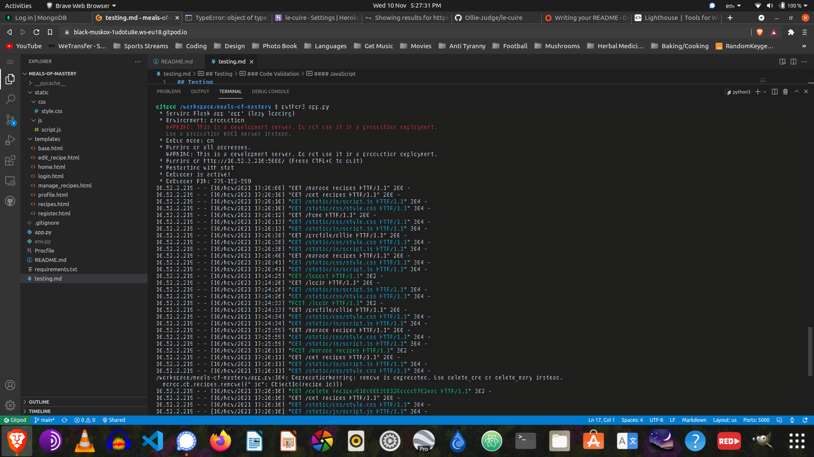
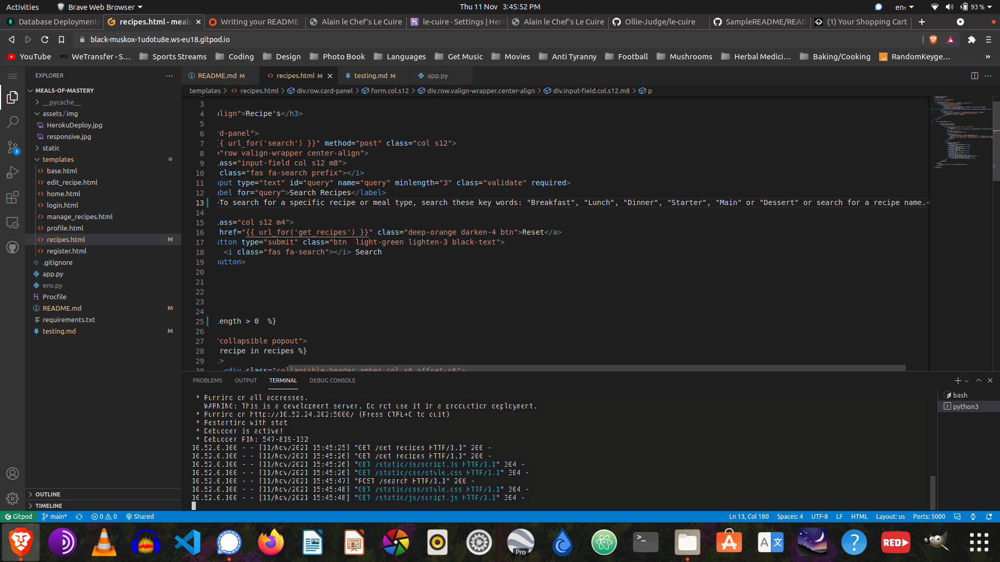

------
### Code Validation

#### Websites used for code validation

* HTML Validator - https://validator.w3.org/
* CSS Validator - https://jigsaw.w3.org/css-validator/
* JavaScript Validator - https://jshint.com/
* Python Validator - http://pep8online.com/

------
#### HTML

#### Home Page
##### Issues
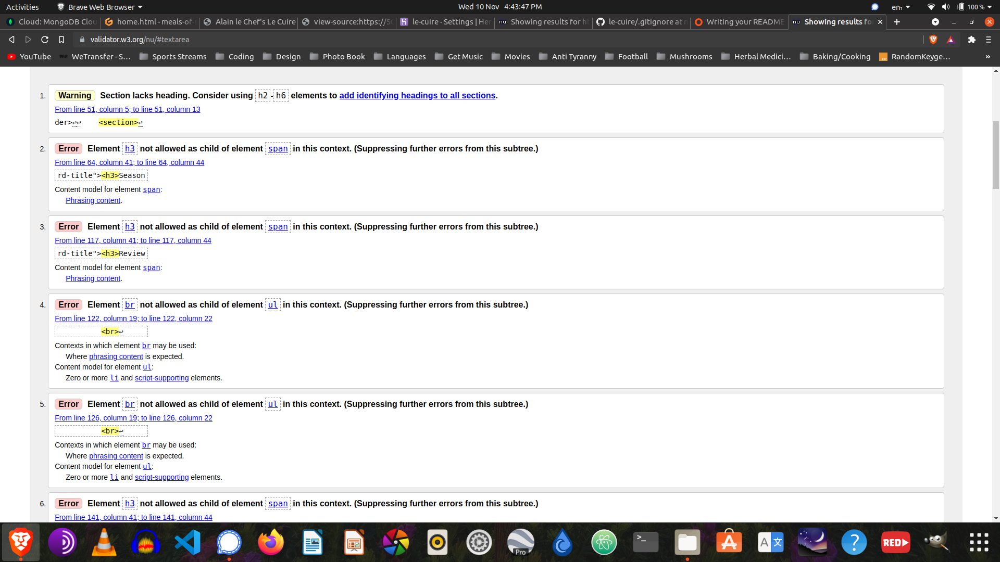
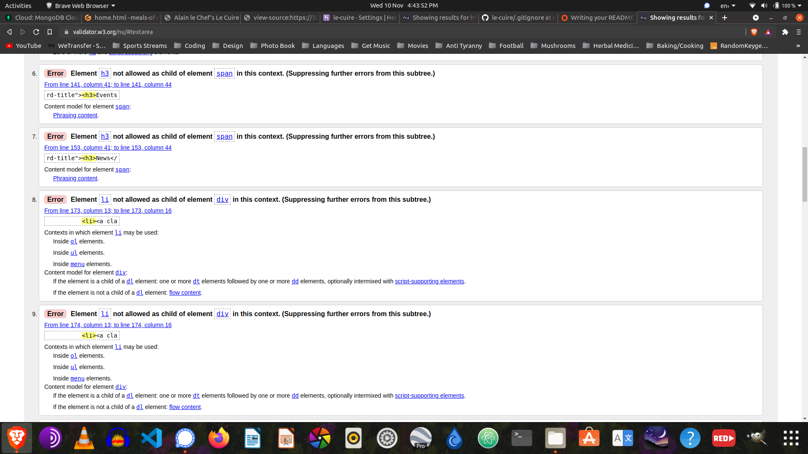
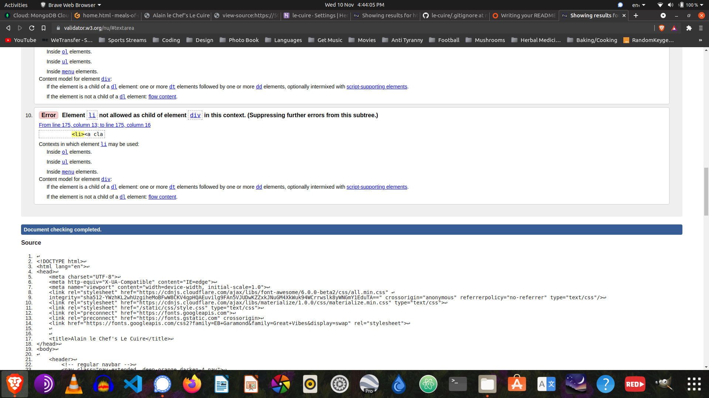

##### Corrected

#### Recipes Page
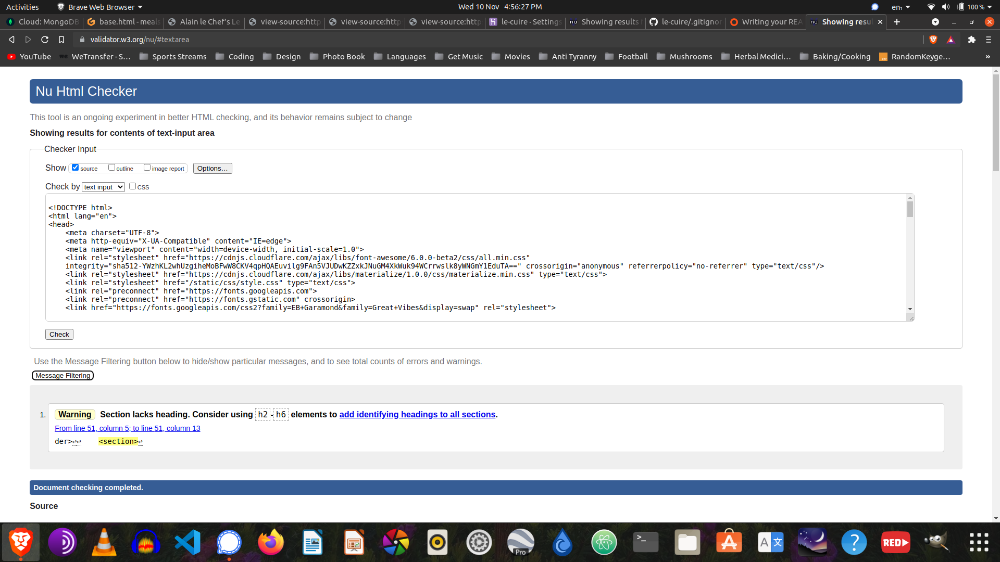

#### Register Page

#### Login Page
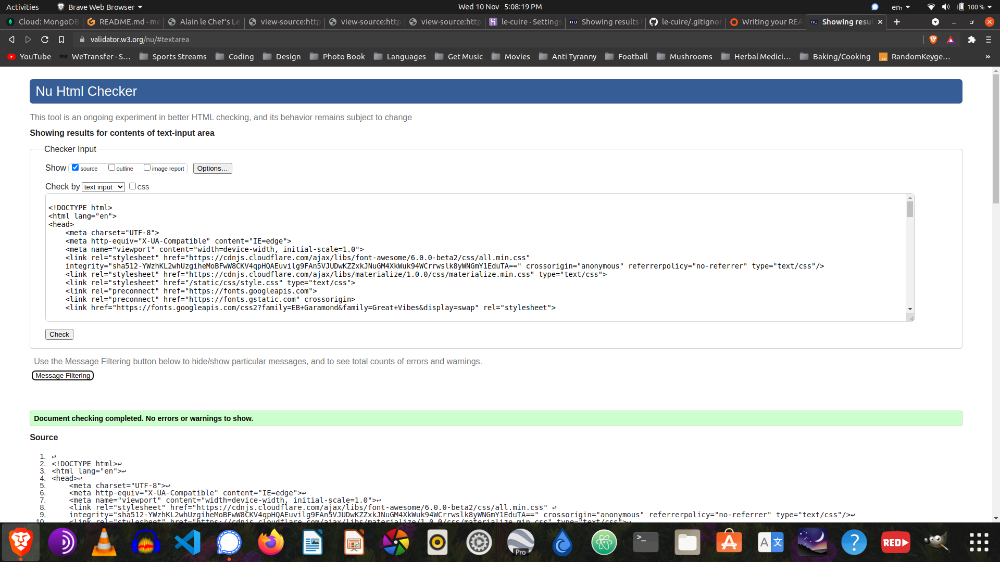

#### Add Recipes Page
##### Issues
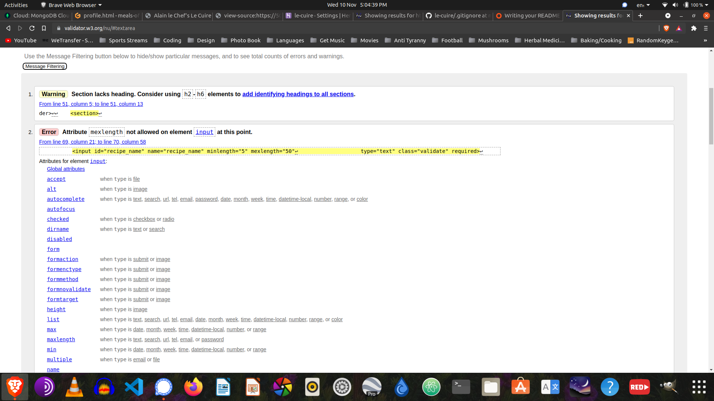

##### Corrected
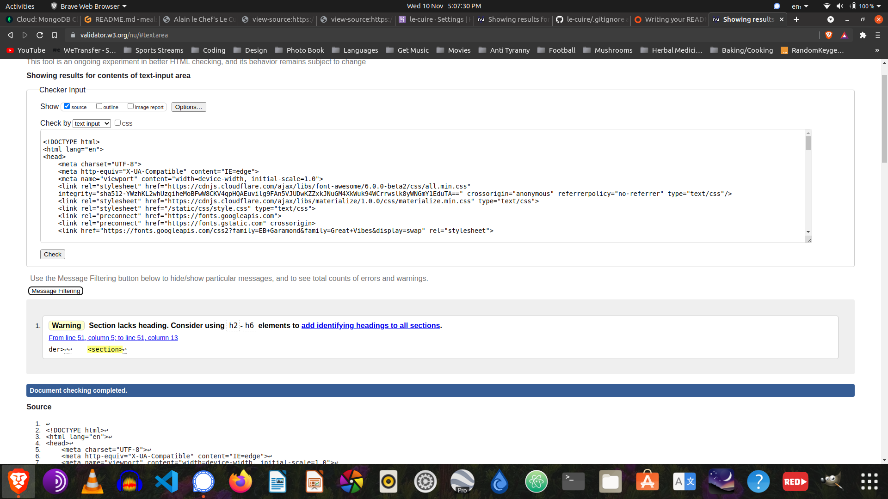

#### Profile Page
##### Issues
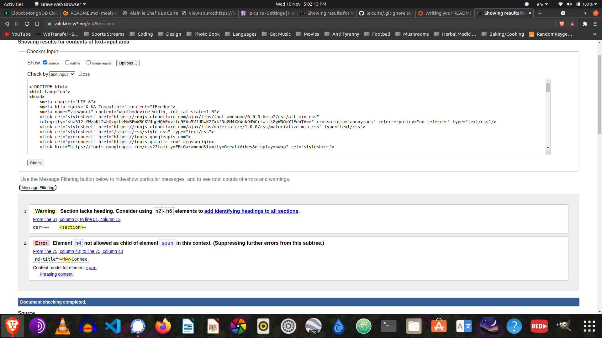

##### Corrected
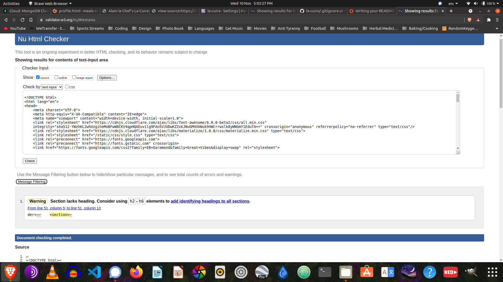

#### Edit Recipes Page
##### Issues
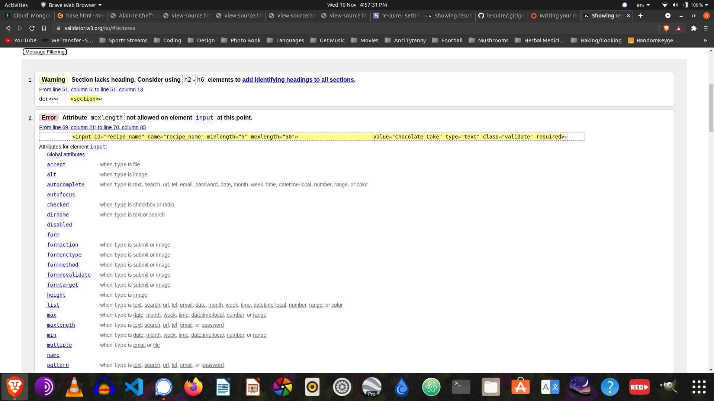

##### Corrected
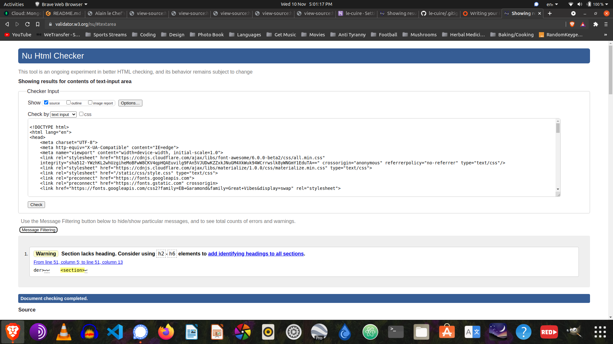
------
#### CSS
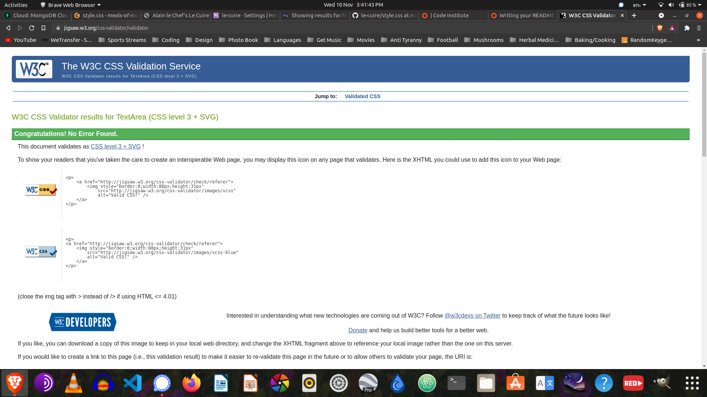
------
#### JavaScript
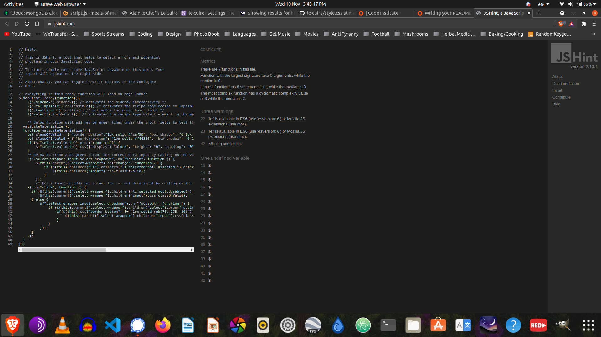

------
#### Python
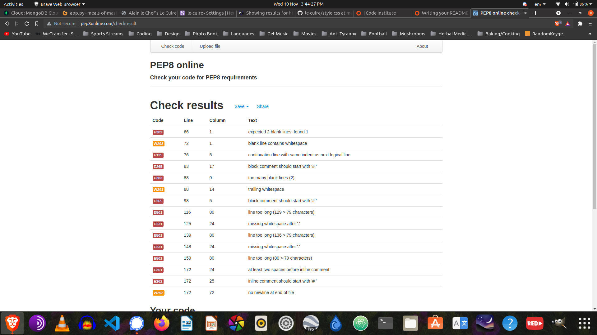

##### Python Correction of Validation
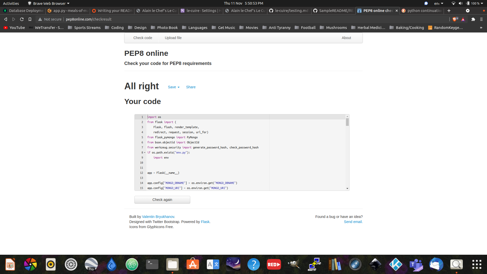
------
### Further Testing

* The Website was tested on Google Chrome, Internet Explorer, Microsoft Edge and Safari browsers.
* The website was viewed on a variety of devices such as Desktop, Laptop, iPhone7, iPhone 8 & iPhoneX.
* A large amount of testing was done to ensure that all pages were linking correctly.
* Friends and family members were asked to review the site and documentation to point out any bugs and/or user experience issues.
* Each section of the website that has interactive functionality, for example navbar, clickable buttons, javascript validation for correct form input and forms have all been manually tested.

------

### Known Bugs

* When viewing on mobile devices the buttons squash up and are not in similar positions to how it looks on computers
